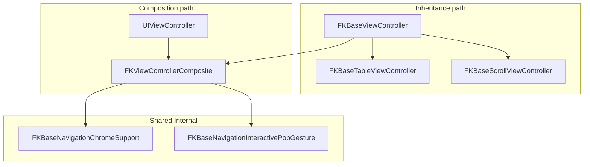

# Base (`FKBase*`)

UIKit-first building blocks for composite screens: **inheritance-friendly** base classes and an optional **composition** layer that avoids subclassing when you only need cross-cutting behavior.

All public types in this folder are documented for **`@MainActor`** usage (UIKit alignment).

**Entry point:** when legacy FKUIKit copies of Base types are still visible (FKKit ≤ 0.60), prefer `FKBusinessKitBase.*` typealiases from `import FKBusinessKit`.

---

## Directory map

```text
Components/Base/
├── README.md                              # This file
├── Controller/
│   ├── FKBaseViewController.swift         # Root base VC (lifecycle + overlays + composite host)
│   ├── FKBaseTableViewController.swift    # Single-table specialization + refresh/load-more
│   ├── FKBaseCollectionViewController.swift
│   ├── FKBaseScrollViewController.swift   # Scroll view + contentView + optional pull-to-refresh
│   ├── FKBaseListPresentation.swift       # FKSkeleton / FKEmptyState list helpers
│   ├── FKBaseListPresentationTypes.swift    # Outcome, options, defaults
│   ├── FKBaseListPresentationCoordinator.swift # begin/finish orchestration
│   └── FKBaseSearchIntegration.swift      # UISearchController attachment helpers
├── Composition/
│   ├── FKViewControllerCompositionProtocols.swift   # Build phases, hosting, forwarding
│   └── FKViewControllerCompositionServices.swift    # FKViewControllerComposite bucket
├── Cell/
│   ├── FKBaseTableViewCell.swift
│   ├── FKBaseCollectionViewCell.swift
│   └── FKBaseReusableCellCore.swift       # Internal layout/shadow helpers
└── Internal/                              # Shared implementation (not public API)
    ├── FKBaseNavigationChromeSupport.swift
    ├── FKBaseNavigationInteractivePopGesture.swift
    ├── FKBaseScrollBounce.swift
    ├── FKBaseViewControllerHierarchy.swift
    ├── FKBaseViewController+StateOverlays.swift
    ├── FKBaseScrollKeyboardFocus.swift
    ├── FKBaseRefreshCoordinator.swift
    └── FKBaseListEmptyStateHost.swift
```

---

## Architecture

### Two integration paths

| Path | When to use | What you get |
|------|-------------|--------------|
| **Subclass** `FKBaseViewController` (or table/collection subclasses) | Default for new screens; one place for lifecycle, overlays, and chrome | `setupUI` / `setupConstraints` / `setupBindings`, loading/empty/error overlays, `FKToast`, first-load hooks |
| **Compose** `FKViewControllerComposite` on a plain `UIViewController` | App already has another base class, or you need only keyboard/nav/tap-to-dismiss | Same cross-cutting behavior without inheriting `FKBaseViewController` |

**Important:** `FKBaseViewController` **internally owns** a `FKViewControllerComposite` and forwards UIKit lifecycle to it. Subclassing the base and using composition manually are **not mutually exclusive concepts** — they share one implementation for navigation chrome, keyboard, interactive pop, and tap-to-dismiss.



### What lives only on `FKBaseViewController`

These are **not** duplicated in `FKViewControllerComposite`:

- Full-page **loading** spinner (`showLoading` / `hideLoading`)
- Full-page **empty** and **error** overlays via **FKEmptyState** (`showEmptyView`, `showErrorView`, …)
- **`FKToast`** helper
- Custom **back button** (`configureBackButton`)
- Three-phase build API: `setupUI` → `setupConstraints` → `setupBindings`
- First-load hooks: `loadInitialContent()` then `viewDidAppearForTheFirstTime(_:)`
- Optional **`logHandler`** / **`debugLifecycleLoggingEnabled`**

List-specific skeleton/empty integration lives on table/collection subclasses via `FKBaseListPresentation.swift`.

---

## View controllers

### `FKBaseViewController`

Common lifecycle entry points, keyboard forwarding, navigation bar snapshot/restore, optional loading / empty / error overlays, `FKToast`, and logging hooks.

#### Lifecycle order

| Callback | Base work (via composite + overlays) | Your overrides |
|----------|----------------------------------------|----------------|
| `viewDidLoad` | Composite bind (tap-to-dismiss, scroll bounce policy), `setupUI`, `setupConstraints`, `setupBindings` | Build hierarchy and bindings |
| `viewWillAppear` | Capture nav snapshot, apply nav visibility/style, install pop-gesture delegate | — |
| `viewDidAppear` | Start keyboard observation; first-load: `loadInitialContent()` → `viewDidAppearForTheFirstTime` | Keyboard hooks |
| `viewWillDisappear` | Stop keyboard; restore nav snapshot **only when permanently leaving** (pop/dismiss/detach) | — |

**First load:** override **`loadInitialContent()`** — runs **once** on the first `viewDidAppear`, **before** **`viewDidAppearForTheFirstTime(_:)`**. Use it to start fetches; use `viewDidAppearForTheFirstTime` for on-screen-only UI (animations).

#### Navigation bar chrome

Public enums:

- **`NavigationBarVisibility`**: `.visible` / `.hidden`
- **`NavigationBarStyle`**: `.system`, `.opaqueDefault`, `.transparent`, `.gradient(colors:locations:startPoint:endPoint:)`

**Snapshot rules** (shared by base class and composition):

1. On the host’s **first** `viewWillAppear`, deep-copy the current `UINavigationBar` appearances (standard, scroll-edge, compact, compact scroll-edge when available), translucency, large-title preference, and hidden state.
2. While visible, apply `navigationBarVisibility`, `navigationBarStyle`, and optional `prefersLargeTitlesWhileVisible`.
3. Custom styles (non-`.system`) apply to the host’s **`UINavigationItem`** appearances so interactive pop transitions can interpolate per controller.
4. **Restore** the snapshot only when the host **permanently leaves** the hierarchy (`isBeingDismissed` or `isMovingFromParent`) — **not** when another controller is pushed on top.
5. Changing `navigationBarVisibility`, `navigationBarStyle`, or `prefersLargeTitlesWhileVisible` **while on-screen** re-applies chrome with animation.

#### Interactive pop gesture

Set **`disablesInteractivePopGesture = true`** to block edge swipe-back while this controller is visible.

Implementation details:

- Captures and restores `interactivePopGestureRecognizer.isEnabled` (and on **iOS 26+** `interactiveContentPopGestureRecognizer.isEnabled`) when leaving permanently.
- Installs a **one-time** forwarding `UIGestureRecognizerDelegate` per `UINavigationController` so UIKit resets to `isEnabled` do not bypass the policy.
- Works for **`FKBaseViewController`** subclasses and **`FKViewControllerCompositeHosting`** adopters.

#### Keyboard

- Observed between `viewDidAppear` and `viewWillDisappear` when **`keyboardObservationEnabled`** is `true` (default).
- Override **`keyboardWillChange(to:duration:curve:)`** and **`keyboardWillHide(duration:curve:)`** — callbacks are always dispatched on the main queue.
- **Focus scrolling** — when **`keyboardFocusScrollView`** is non-nil and **`scrollsFirstResponderVisibleOnKeyboardChange`** is `true` (default), ``keyboardWillChange`` scrolls the first responder into view. Scroll/collection subclasses set the hook; plain ``FKBaseViewController`` leaves it `nil` (hook-only). Pair with **`keyboardLayoutGuide`** bottom constraints on scroll subclasses for layout shrink.

#### Configuration reference

| Property | Default | Role |
|----------|---------|------|
| `dismissKeyboardOnTapEnabled` | `true` | Tap outside controls → `endEditing` |
| `disableScrollViewBounceByDefault` | `true` | Recursively disables scroll view bounce in `view` subtree |
| `disablesInteractivePopGesture` | `false` | Block interactive pop while visible |
| `navigationBarVisibility` | `.visible` | Hide/show bar while on-screen |
| `navigationBarStyle` | `.system` | Bar/item appearance |
| `prefersLargeTitlesWhileVisible` | `nil` | Override large titles; `nil` → snapshot value |
| `keyboardObservationEnabled` | `true` | Toggle keyboard notifications |
| `keyboardFocusScrollView` | `nil` | Scroll view for first-responder focus scrolling; set by scroll/collection subclasses |
| `scrollsFirstResponderVisibleOnKeyboardChange` | `true` | Scroll focused input when `keyboardFocusScrollView` is non-nil |
| `preferredStatusBarAppearance` | `.default` | Status bar style |
| `debugLifecycleLoggingEnabled` | `false` | Forward lifecycle to `FKLogger` |
| `stateOverlayTopLayoutAnchor` | safe-area top | Top of the shared empty/error overlay |
| `stateOverlayTopInset` | `0` | Extra inset below ``stateOverlayTopLayoutAnchor`` |

#### State overlays

| API | Behavior |
|-----|----------|
| `showLoading()` / `hideLoading()` | Centered `UIActivityIndicatorView`; hides empty/error |
| `showEmptyView(message:)` | Content-region `FKEmptyState` (empty phase) below ``stateOverlayTopLayoutAnchor`` |
| `showErrorView(message:retryTitle:retryHandler:)` | Content-region `FKEmptyState` (error phase, optional retry) |
| `showToast(_:)` | Short banner via `FKToast` |

**Layout contract:** ``stateOverlayTopLayoutAnchor`` (default: safe-area top) and ``stateOverlayTopInset`` pin the shared overlay. The overlay is inserted **below** subviews added in ``setupUI()`` so fixed chrome (filter strips, demo controls) stays tappable. Override the top anchor when chrome should remain visible above empty/error states.

For **list** screens, prefer scroll-embedded empty states (`applyListEmptyState`) and skeleton placeholders (see below) instead of these controller-level overlays.

---

### `FKBaseScrollViewController`

Single primary `UIScrollView` with a scrollable **`contentView`**, pinned to the safe area and **`keyboardLayoutGuide`** (iOS 15+). Optional pull-to-refresh via **FKUIKit** `fk_addPullToRefresh`.

**Keyboard avoidance (two layers):**

1. **Layout** — scroll view bottom tracks **`keyboardLayoutGuide.topAnchor`** so the visible area shrinks with the keyboard.
2. **Focus** — ``FKBaseViewController/keyboardWillChange(to:duration:curve:)`` scrolls the first responder when ``keyboardFocusScrollView`` returns ``scrollView`` (see ``scrollsFirstResponderVisibleOnKeyboardChange``).

**Defaults:**

- Sets **`disableScrollViewBounceByDefault = false`** in `init` so overflow content remains scrollable.
- **`contentLayoutMargins`** inset the content root inside the scroll view's content layout guide.
- **`contentInsetAdjustmentBehavior = .never`** — safe-area top is handled by pinning the scroll view to **`safeAreaLayoutGuide`**.
- Load-more is **not** supported; use table/collection bases for paginated lists.

**Pull-to-refresh:**

- Set **`isPullToRefreshEnabled`** in **`init`** (before `setupBindings()`).
- Override **`performPullToRefresh()`**; end with **`endPullToRefresh(success:)`**.

Add subviews inside **`contentView`**, not directly on **`scrollView`**.

---

### `FKBaseTableViewController` / `FKBaseCollectionViewController`

Single primary `UITableView` or `UICollectionView`, pinned below ``FKBaseTableViewController/tableViewTopLayoutAnchor`` (default: safe area top) and **`keyboardLayoutGuide`** (iOS 15+). Optional pull-to-refresh and load-more via **FKUIKit** `fk_addPullToRefresh` / `fk_addLoadMore`.

**Keyboard:** same **`keyboardLayoutGuide`** layout shrink as scroll screens. ``FKBaseCollectionViewController`` sets ``keyboardFocusScrollView`` to its collection view. ``FKBaseTableViewController`` leaves the hook `nil` and relies on ``UITableView``'s built-in editing scroll.

**List defaults:**

- Sets **`disableScrollViewBounceByDefault = false`** in `init` so pull-to-refresh remains ergonomic.
- Does **not** implement `dataSource` / `delegate` — subclasses assign them (or use diffable data sources).
- Refresh/load-more wiring is shared via **`FKBaseRefreshCoordinator`** (Internal).

**Refresh / load-more:**

- Set **`isPullToRefreshEnabled`** / **`isLoadMoreEnabled`** in **`init`** (before `setupBindings()`).
- Override **`performPullToRefresh()`** / **`performLoadMore()`**.
- End cycles with **`endPullToRefresh(success:)`**, **`markLoadMoreFinished()`**, **`markLoadMoreNoMoreData()`**, **`markLoadMoreFailed(_:)`**.

#### `FKBaseLoadMoreState` vs `FKRefreshState`

| Type | Layer | Purpose |
|------|-------|---------|
| **`FKRefreshState`** (FKUIKit) | Refresh **control UI** | Pulling, ready, refreshing, loading-more, no-more-data, failed — drives gestures, animation, copy |
| **`FKBaseLoadMoreState`** | Controller **pagination** | `idle`, `loading`, `completed`, `failed` — guards duplicate fetches and marks exhaustion |

`FKBaseTableLoadMoreState` is a deprecated alias for **`FKBaseLoadMoreState`**.

#### List presentation (`FKBaseListPresentation*.swift`)

Integrates **FKSkeleton** placeholder rows and **FKEmptyState** host overlays per [list-presentation-spec.md](../../../../docs/list-presentation-spec.md):

| API | Role |
|-----|------|
| `beginListLoadIfNeeded(isRefresh:currentItemCount:)` | Starts skeleton on empty first-page refresh |
| `finishListLoadPresentation(outcome:isRefresh:retryHandler:)` | Ends skeleton + syncs host empty/error (no refresh/load-more) |
| `listPresentationOptions` / `FKBaseListPresentationDefaults` | Skeleton count, empty/error presets |
| `listEmptyStateHostView` / `listEmptyStateClearingScrollView` | Default host `view`; clears legacy `tableView` overlays |
| `listDataSourceRowCount` / `dequeueDefaultSkeletonTableCell` | DataSource skeleton helpers |
| `handleListEmptyStatePrimaryAction()` | Programmatic pull-to-refresh from empty state |
| `applyListEmptyState` / `syncListEmptyState` / `hideListEmptyState` | Host-based empty/error overlays |

**Migration:** override `listEmptyStateHostView { tableView }` to restore scroll-embedded empty state.

---

### `FKBaseSearchIntegration`

Static helpers to attach or remove a **`UISearchController`** on **`navigationItem`** (`definesPresentationContext`, `hidesNavigationBarDuringPresentation`). Does not replace app-specific search results UI.

---

## Cells

### `FKBaseTableViewCell` / `FKBaseCollectionViewCell`

Shared **`containerView`**, reuse identifiers, card-style chrome, **`prepareForReuse`** → **`resetCellContent()`**, trait and selection hooks.

**Dequeue helpers** (FKKit snake_case convention):

```swift
let cell = tableView.fk_dequeueCell(MyCell.self, for: indexPath)
let cell = collectionView.fk_dequeueCell(MyCell.self, for: indexPath)
```

### Configuring with models

**Do not** add a generic `configure(_ model:)` on the open base classes — model binding is app-specific.

**Recommended:** conform your cell subclass to FKCoreKit pluggable protocols (`FKListTableCellConfigurable`, etc.) or add a typed `configure(with:)` on the subclass.

---

## Composition (no base-class inheritance)

When you **cannot** subclass `FKBaseViewController`:

### Protocols

| Protocol | Role |
|----------|------|
| **`FKViewControllerBuildPhases`** | `buildInterface()` → `buildConstraints()` → `bindInteractions()`; call **`runBuildPhases()`** from `viewDidLoad` |
| **`FKViewControllerCompositeHosting`** | Owns **`composite: FKViewControllerComposite`** |
| **`FKViewControllerTraitChangeHandling`** | `handleTraitCollectionChange(_:)` hook |

### `FKViewControllerComposite` services

| Service | Property | Notes |
|---------|----------|-------|
| Keyboard | `composite.keyboard` | `onWillChangeFrame`, `onWillHide`, `isEnabled` |
| Navigation chrome | `composite.navigationChrome` | Same snapshot/style rules as base class |
| Interactive pop | `composite.interactivePopGesture` | `disablesInteractivePopGesture` |
| Tap to dismiss | `composite.tapToDismissKeyboard` | `isEnabled` |
| Appearance flags | `composite.appearanceState` | `hasCompletedInitialAppearance`, `isViewAppeared`, `onFirstAppearance` |
| Scroll bounce | `disablesScrollBounceRecursivelyByDefault` | Applied in `viewDidLoad` |

Forward UIKit callbacks:

```swift
override func viewWillAppear(_ animated: Bool) {
  super.viewWillAppear(animated)
  forwardComposite(.viewWillAppear(animated: animated))
}
// … viewDidLoad, viewDidAppear, viewWillDisappear, viewDidDisappear
```

See `Composition/FKViewControllerCompositionProtocols.swift`, `FKViewControllerCompositionServices.swift`, and the **Composition** example in FKBusinessKitExamples.

---

## Subclassing vs composition — decision guide

| Need | Choose |
|------|--------|
| Table/collection screen with refresh, skeleton, empty | **`FKBaseTableViewController`** / **`FKBaseCollectionViewController`** |
| Form, detail, or settings page with scrollable content | **`FKBaseScrollViewController`** |
| Non-list screen with loading/empty/error overlays (custom layout) | **`FKBaseViewController`** (+ your keyboard layout if needed) |
| Only keyboard + nav chrome + tap-to-dismiss | **`FKViewControllerComposite`** on your existing base |
| Another app base class you cannot change | Composition + **`FKViewControllerBuildPhases`** |
| Shared card-style cells | **`FKBaseTableViewCell`** / **`FKBaseCollectionViewCell`** + pluggable configure protocols |

---

## Examples

FKBusinessKitExamples → **Base** hub:

| Scenario | Demonstrates |
|----------|--------------|
| ViewController | Overlays, keyboard, nav styles, first-load hooks |
| Scroll | `FKBaseScrollViewController` — contentView, keyboard avoidance, pull-to-refresh |
| Table / Collection | Refresh, skeleton, empty/error list states |
| Composition | Plain `UIViewController` + composite forwarding |
| Search | `FKBaseSearchIntegration` |

When FKUIKit still exports legacy Base types (FKKit ≤ 0.60), qualify APIs with **`FKBusinessKit.`** or use **`FKBusinessKitBase`** typealiases in example code.
