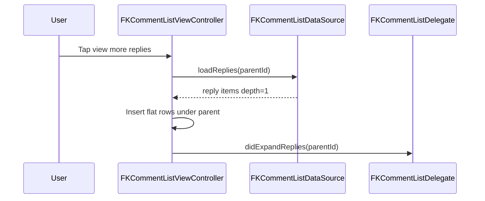

# FKCommentKit — Design & Implementation Guide

FKBusinessKit **comment UI kit** for open-source reuse: list presentation, row actions (like / reply / more), composer, and flat `replyTo` threading — with **no networking**. Apps inject data and side effects through protocols.

**Document type:** Design & implementation guide (normative for implementers)  
**Status:** Accepted (v1)  
**Module path:** `Sources/FKBusinessKit/Components/CommentKit/`  
**Language:** English for public API, DocComments, README, and this guide  
**Related:** [FKCellKit_DESIGN.md](FKCellKit_DESIGN.md), CellKit `FKCommentThreadCell` (display-only), `FKReviewListCell` (product reviews — separate)

---

## 1. Overview

### 1.1 One-liner

**CommentKit owns “comment UX chrome + interaction contracts”; the App owns “API, auth, moderation, and domain mapping.”**

### 1.2 Placement in the FK stack

```text
┌────────────────────────────────────────────────────────────┐
│ App — networking, auth, moderation, analytics, mapping     │
└────────────────────────────┬───────────────────────────────┘
                             │ FKCommentListDataSource / Delegate
┌────────────────────────────▼───────────────────────────────┐
│ FKBusinessKit CommentKit                                    │
│  List VC · Row cell · Action bar · Composer · Like helper  │
└───────┬───────────────────────────────┬────────────────────┘
        │ reuses                         │ reuses
┌───────▼──────────────┐    ┌───────────▼────────────────────┐
│ CellKit / Base       │    │ FKUIKit (Avatar, ListKit, …)   │
└──────────────────────┘    └────────────────────────────────┘
```

### 1.3 Locked product decisions

| Decision | Choice |
|----------|--------|
| Encapsulation depth | **UI kit** — callbacks + injectable data source; no HTTP |
| Thread model | **Flat list + `replyTo`** (content-app style) |
| Completeness | **P0 + P1 in v1** to minimize long-term forking |
| Host package | **FKBusinessKit** (not FKKit) |
| Examples / tests (this delivery) | **Deferred** |

---

## 2. Goals, non-goals, success criteria

### 2.1 Goals

1. Reusable comment list + composer across apps without copying UI.
2. Protocol-oriented App integration (`DataSource` / `Delegate`).
3. Flat + `replyTo` with inline reply expand (capped depth for indent only).
4. Optimistic like with explicit rollback for failed network.
5. Swift 6 / `@MainActor` UI / `Sendable` models / English DocComments.
6. Compose CellKit + Base + FKUIKit; do not fork ListKit or Widgets.

### 2.2 Non-goals

| Excluded | Why |
|----------|-----|
| HTTP / auth / moderation services | App responsibility |
| Product review ratings UI | Use `FKReviewListCell` |
| Reddit-style deep nested tree as primary API | Maintenance cost; not the locked model |
| Replacing CellKit `FKCommentThreadCell` | Keep as display-only primitive |
| Unit / UI tests and Examples scenes (this delivery) | Explicitly deferred |

### 2.3 Success criteria (v1)

- [ ] `docs/FKCommentKit_DESIGN.md` and `Components/CommentKit/README.md` exist.
- [ ] Public models, protocols, configuration, views, list controller, optimistic like helper compile under `SWIFT_STRICT_CONCURRENCY=complete`.
- [ ] App can drive load / like / reply / expand / submit without subclassing networking into the kit.
- [ ] `FKCommentThreadCell` and `FKReviewListCell` remain untouched in behavior.

---

## 3. Thread model (flat + replyTo)

### 3.1 Semantics

- **Top-level** comments: `depth == 0`, `parentId == nil` (or equal to the content root — App convention).
- **Reply rows** in the same flat table: `depth == 1` (kit caps visual indent; deeper values clamp to max depth for layout only).
- Each item may carry `replyTo: FKCommentReplyTarget?` (id + display name) for “Replying to @Name” chrome.
- Parent rows expose `replyCount` and optional expand affordance (“View N replies”).

### 3.2 Expand flow



### 3.3 Reply compose flow

1. User taps **Reply** on a row → kit sets composer `replyTarget`.
2. User sends → `DataSource.submit(FKCommentSubmitRequest)`.
3. On success, App returns the new `FKCommentItem`; kit inserts and clears the reply target.
4. On failure, kit restores composer text / sending state per configuration.

---

## 4. Public API catalog

### 4.1 Models

| Type | Role |
|------|------|
| `FKCommentReplyTarget` | `id` + `displayName` for reply-to chip / composer banner |
| `FKCommentItem` | Row view model (likes, replies, flags, depth) |
| `FKCommentListPage` | Paginated page: `items`, `hasMore` |
| `FKCommentSubmitRequest` | `text` + optional `replyToCommentId` |
| `FKCommentMoreAction` | `copy`, `delete`, `report` (menu building blocks) |

### 4.2 Protocols

| Protocol | Role |
|----------|------|
| `FKCommentListDataSource` | Load first/next page, load replies, submit text |
| `FKCommentListDelegate` | Like, reply, more actions, author tap, expand, lifecycle hooks |

Completion handlers are `@MainActor` / `Sendable`-safe where required. **No** default networking.

### 4.3 Configuration

| Type | Role |
|------|------|
| `FKCommentKitConfiguration` | Feature flags (actions, max preview replies, pull/load-more) |
| `FKCommentRowCellConfiguration` | Typography, indent, avatar |
| `FKCommentActionBarConfiguration` | Visible actions, symbols |
| `FKCommentComposerConfiguration` | Placeholder, send title, max length |
| `FKCommentKitStrings` | English defaults; App may replace for localization |

### 4.4 Views & controller

| Type | Role |
|------|------|
| `FKCommentActionBarView` | Like / Reply / More |
| `FKCommentComposerView` | Input + send + reply-target banner |
| `FKCommentRowCell` | Interactive comment row (`FKCellKitTableCell`) |
| `FKCommentListViewController` | Table + composer + refresh/load-more wiring; `updateComment` / `removeComment` |
| `FKCommentLikeOptimisticController` | Toggle like + rollback helper |
| `FKCommentListRegistration` | Optional ListKit registration for the row cell |

Additional v1 hardening (additive, non-breaking):

- `showsComposer` for read-only lists
- Expandable body via `FKExpandableText` (`usesExpandableBody`)
- Composer `maxContentHeight` with internal scrolling
- Always surface a just-submitted reply under its parent
- Deduped load-more / empty more-menu guard / action-sheet `cancel` string

---

## 5. Source layout

```text
Components/CommentKit/
├── README.md
├── Public/
│   ├── Models/
│   ├── Protocols/
│   ├── Configuration/
│   ├── Presets/
│   │   ├── FKCommentLayoutPreset.swift
│   │   └── Compact/          # compact row, rail, defaults
│   ├── Views/
│   ├── Controller/
│   └── Core/
└── Internal/
```

`Package.swift` excludes `Components/CommentKit/README.md` from the compile target.

---

## 6. Relation to CellKit

| Type | Relationship |
|------|----------------|
| `FKCommentThreadCell` | Display-only indented thread row — **keep**. Prefer CommentKit when actions/composer are needed. |
| `FKCommentRowCell` | CommentKit interactive row (action bar + expand + reply-to). |
| `FKReviewListCell` | Product reviews — **do not merge**. |

---

## 7. Layout presets vs configuration

CommentKit must stay usable across product skins without becoming an infinite “compose any cell” toolkit. Use this rule when extending UI.

### 7.1 Decision (normative)

| Need | Mechanism |
|------|-----------|
| **Whole-page / row skeleton change** (action placement, author + reply-to composition, timestamp placement, compact vs feed density) | Add a **layout preset** (second or small set of row templates + default tokens). **Do not** try to express it only through today’s `FKCommentKitConfiguration` knobs. |
| **Local differences** (avatar size, icon tint, string formats, show/hide like·reply·more, indent / `maxDepth`, composer limits) | Use **configuration** / strings on the active preset. |
| **App-specific one-off chrome** | Prefer hosting ``FKCommentRowCell`` via ListKit + a custom list VC, or a future narrow provider hook — **not** unbounded view injection on the main path. |

**One-liner:** *Presets own layout skeletons; configuration owns tokens and feature flags within a preset. Do not “skin” a different skeleton with parameters alone.*

### 7.2 Why configuration alone is not enough

v1 configuration covers tokens and flags (sizes, colors, icons, visibility, copy). It does **not** redefine the row’s layout model. Examples of changes that require a **new preset**, not more knobs:

| Change | Why config is insufficient |
|--------|----------------------------|
| Move like / reply from a horizontal bottom stripe to another column or edge | Different Auto Layout graph |
| Fold “replying to …” into the author line (e.g. name + affordance + target) | Different header composition |
| Relocate timestamp / metadata under the body vs trailing header | Different chrome roles |
| Strongly different hit targets (body-first reply vs explicit Reply control) | Different interaction map |

Stretching the current cell with dozens of optional slots (every region injectable) raises maintenance cost and makes Examples / docs hard to trust.

### 7.3 How to add a layout preset (checklist)

When a product needs a skeleton that the current preset cannot express:

1. **Keep the interaction core stable** — `FKCommentListDataSource` / `FKCommentListDelegate`, flat `replyTo`, optimistic like, composer submit contracts stay shared.
2. **Name a preset** — e.g. `standard`, `compact`. Prefer a **small fixed set**, not one preset per app. Avoid brand names in public API.
3. **Ship the preset under `Public/Presets/`** — enum case on ``FKCommentLayoutPreset``, concrete row template + defaults (e.g. `Presets/Compact/`).
4. **Allow limited tokens on top** — sizes, tints, icons, strings, action visibility; document which knobs are valid for that preset.
5. **Wire selection at the kit edge** — `commentConfiguration = .configuration(for: .compact)` or set ``FKCommentKitConfiguration/layoutPreset``. Examples must demonstrate each preset in a dedicated **Layout presets** group.
6. **Do not** grow the default cell into a universal assembler to avoid adding a preset.

### 7.4 Current presets

| Preset | Row template | Notes |
|--------|--------------|-------|
| ``standard`` | ``FKCommentRowCell`` | Feed-style: avatar, author + timestamp header, body, bottom action stripe |
| ``compact`` | ``FKCommentCompactRowCell`` | Denser social-style chrome: author → body → meta (like · Reply · more · time), author ▸ reply-to on nested rows, capsule composer + Send / optional reply banner. Not tied to a product category. |

- **Configuration:** tokens and flags within the active preset; see ``FKCommentKitConfiguration`` and nested row / action-bar / composer configs (text styles, optional font weights, colors, spacings, action / chevron icons).
- **Factory:** ``FKCommentKitConfiguration/configuration(for:)`` or ``FKCommentCompactDefaults/makeConfiguration()``.
- **Not configuration:** whole-skeleton changes (see §7.2) — add a preset instead of injecting arbitrary views per region.

### 7.5 Anti-patterns (presets)

- Encoding an alternate skeleton as a pile of boolean “layout mode” flags on the default cell.
- Adding arbitrary `UIView` injection for every region “just in case.”
- Duplicating DataSource / Delegate / mutation logic per preset (share the core; swap presentation).
- Using brand- or product-specific names in public API (prefer neutral preset names: `standard`, `compact`, …).

---

## 8. Anti-patterns

- Embedding URLSession / GraphQL / auth tokens inside CommentKit.
- Making nested trees the primary public API.
- Hard-coding localized Chinese (or any non-English) strings in source.
- Breaking `FKCommentThreadCell` public API for CommentKit needs.
- Shipping placeholder / TODO public APIs.
- Achieving a different row skeleton only by extending configuration (see §7).

---

## 9. Delivery phases

| Phase | Scope |
|-------|--------|
| **v1 (this work)** | Design doc + CommentKit module |
| **v1.1** | FKBusinessKitExamples CommentKit hub (grouped scenarios) |
| **v1.2** | ``compact`` layout preset + Layout presets Examples group |
| **Later** | Additional layout presets when product skeletons diverge; media attachments in composer; sort tabs if multi-app demand is proven |

---

## 10. Revision history

| Date | Change |
|------|--------|
| 2026-09-11 | Initial accepted design: UI kit, flat + replyTo, P0+P1 v1 |
| 2026-09-11 | §7 Layout presets vs configuration (normative guidance for future UI) |
| 2026-09-11 | §7.4 ``compact`` preset shipped under `Public/Presets/Compact/` (renamed from working name `shortVideo` — layout-agnostic, not product-category-bound) |
