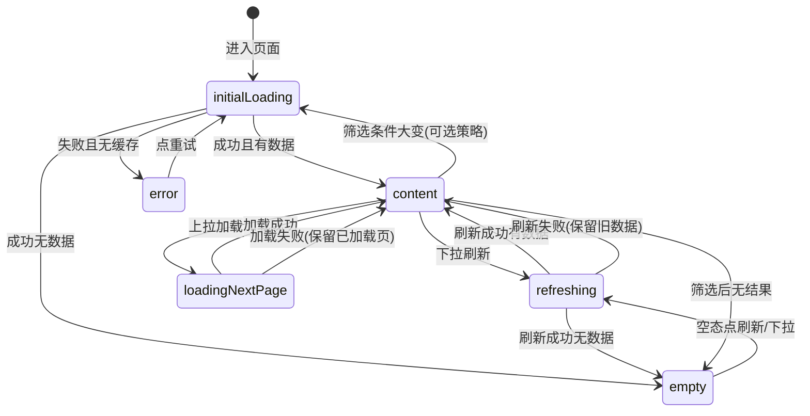

# 列表页展示与状态规范

> **版本**：1.0  
> **文档类型**：设计规范（对使用 FKBusinessKit / FKUIKit 的 App Feature 具有约束力）  
> **适用范围**：继承 `FKBaseTableViewController` / `FKBaseCollectionViewController` 的分页列表、本地筛选列表、嵌入 Tab 的子列表；以及采用 FKUIKit `FKDiffableTableViewController` 的新页（语义对齐，API 略有差异）。  
> **目标**：统一「刚进入 / 网络错误 / 无数据 / 下拉刷新 / 上拉加载 / 筛选切换」等场景的 UI 与交互，避免各 Feature 自行发明 loading、空态与错误反馈。

**关联文档：**

- [Components/Base/README.md](../Sources/FKBusinessKit/Components/Base/README.md) — Base 控制器与 List Presentation API
- [FKCellKit_DESIGN.md §16](FKCellKit_DESIGN.md#16-骨架屏与空态协同) — Cell 与骨架/空态边界
- FKBusinessKitExamples → **Base → Table List Scenarios** — 可运行场景演示

---

## 目录

- [1. 设计原则](#1-设计原则)
- [2. 术语与状态机](#2-术语与状态机)
- [3. 分场景规范](#3-分场景规范)
- [4. 视觉与文案](#4-视觉与文案)
- [5. 代码结构与职责](#5-代码结构与职责)
- [6. 集成路径选择](#6-集成路径选择)
- [7. 页面类型速查](#7-页面类型速查)
- [8. 与 FKUIKit / FKBusinessKit 能力对照](#8-与-fkuikit--fkbusinesskit-能力对照)
- [9. 反模式](#9-反模式)
- [10. 落地清单](#10-落地清单)
- [11. 参考文件索引](#11-参考文件索引)
- [12. 修订记录](#12-修订记录)

---

## 1. 设计原则

1. **复用 FK 能力，不重复造轮子**  
   骨架屏、空态、下拉刷新、加载更多 footer 分别使用 FKBusinessKit / FKUIKit 已有 API（`FKSkeletonTableViewCell`、`FKEmptyState`、`FKRefreshControl`），禁止自写全屏 HUD 盖住列表（表单提交等**阻塞型**操作除外）。

2. **状态与数据分离**  
   - **数据**：App 侧 ViewModel + DataStore（items、pagination、filters）  
   - **展示**：ViewController 根据 outcome 驱动本文定义的状态机  
   - **网络**：ViewModel / Gateway，**不做** UI 副作用（不 Toast、不 `reloadData`）

3. **有内容时优先保留内容**  
   下拉刷新失败、上拉加载失败、筛选后请求失败：若屏幕上已有有效数据，**不**用全屏错误页替换列表，仅用 Toast + 刷新控件反馈。

4. **空态挂载位置有意识选择**  
   - **默认（列表页）**：`applyListEmptyState` / `syncListEmptyState` 挂在 `tableView` / `collectionView` 上（FKBusinessKit `FKBaseListPresentation`）。  
   - **需固定不随下拉位移**：改用 `FKBaseViewController` 控制器级 overlay（`showEmptyView` / `showErrorView`），并通过 `stateOverlayTopLayoutAnchor` 对齐列表可视区域；或 App 侧在 `view` 上挂 sibling 空态 host（见 §3.3 注）。

5. **渐进落地**  
   本文档为**目标规范**；存量页面按 [§10 落地清单](#10-落地清单) 分批对齐，新页面从第一版即遵守。

---

## 2. 术语与状态机

### 2.1 列表展示阶段（`ListPresentationPhase`）

与 FKUIKit `FKListPresentationState` 语义对齐，App 与库文档统一使用下列阶段名：

| 阶段 | 含义 | 用户可见 |
|------|------|----------|
| `initialLoading` | 首次进入，尚无可用列表数据 | 骨架行 **或**（少数场景）`FKEmptyState` loading 相位 |
| `content` | 至少有一条可展示数据 | 真实 Cell |
| `empty` | 请求成功且确定无数据（含筛选无结果） | `FKEmptyState` 空态 |
| `error` | 请求失败且**无**可展示的缓存数据 | `FKEmptyState` 错误态 + 重试 |
| `refreshing` | 下拉刷新进行中 | 保留当前内容 + 顶部 `FKRefreshControl` |
| `loadingNextPage` | 上拉加载下一页 | 保留当前内容 + 底部 load-more footer |



### 2.2 三类「无数据」必须区分

| 类型 | 触发条件 | 展示 | 主按钮 |
|------|----------|------|--------|
| **业务空** | 请求成功且列表为空 | `phase: .empty`（或 scenario 自定义） | 「刷新」或业务动作（去选课、去学习） |
| **筛选空** | 本地筛选 / 搜索后无匹配项 | 同空态，文案强调「无匹配结果」 | 清除筛选 / 修改关键词 |
| **错误空** | 传输失败 / 业务失败 / 会话过期，且无缓存数据 | `phase: .error` 或 scenario `.loadFailed` / `.noNetwork` | 「重试」 |

**禁止**把网络错误做成「暂无数据」文案；**禁止**在首次加载失败时只弹 Toast 而不给可点击的重试入口。

### 2.3 请求结果与 UI 映射（App 侧约定）

App 可将网关 / 本地 fetch 结果归一化为下列 outcome，再映射 UI：

| Outcome | 有数据时 UI | 无数据时 UI | Toast（默认开启） |
|---------|-------------|-------------|-------------------|
| `appliedPage` | `content` | — | 无 |
| `emptyPage` | — | `empty` | 无 |
| `failed` | 保持 `content`，结束刷新为失败 | `error` | 有 |
| `sessionExpired` | 同上 | `error`（或 Toast + 登录） | 有 |

---

## 3. 分场景规范

### 3.1 刚进入页面（首次加载）

**默认策略（网关分页列表，占绝大多数）**

1. 在 `loadInitialContent()` 中发起首屏请求（`fetchPage(isRefresh: true)` 或等价 API）。
2. **在请求发出前**调用 `beginSkeletonPlaceholderLoading()`（FKBusinessKit）。
3. `numberOfRows` / `numberOfItems` 在 `isShowingSkeletonPlaceholders == true` 时返回 `skeletonPlaceholderCount`（建议 **6–8**）。
4. `cellForRow` / `cellForItem` 出队 `FKSkeletonTableViewCell` / `FKSkeletonCollectionViewCell`，调用 `configureDefaultSkeletonTableCell` / `configureDefaultSkeletonCollectionCell`；子类可覆写骨架布局以贴近真实 Cell 高度。
5. 请求返回后 **先** `endSkeletonPlaceholderLoading(reloadData: false)`，再写入数据 store 并 `reloadData()` / apply snapshot，最后 `syncListEmptyState` 或 `hideListEmptyState`。

**禁止**

- 首次进入使用全屏 blocking loading（`showLoading()` / `AppToast.loadingShow()`）挡住整页。
- 首次进入零交互的纯白屏 / 空 `tableView`（用户无法感知加载中）。

**例外 A：复合布局页（非纯列表）**

如首页 Feed、个人中心模块拼装页：

- 可先展示**本地默认结构**（静态模块占位），再静默刷新局部模块。
- 模块内嵌列表在子 VC 内单独遵守本规范。
- 不要求整页骨架，但**每个依赖网络的模块**应有模块级 loading（骨架 Cell / 模块内 `FKEmptyState` / 禁用按钮）。

**例外 B：嵌入 Tab / 分页容器的子页**

- 仅当前选中 Tab 的子 VC 执行 `loadInitialContent`；未展示 Tab 可延迟加载。
- 子页隐藏外层导航栏时，空态仍对齐列表区域，不遮挡外层 chrome。

**例外 C：纯本地 / Mock 列表**

- 无网络延迟：直接填充数据 + `reloadData()`，**跳过**骨架。
- 接口未就绪的 Mock 页：应显式注释，接入网关后改为默认策略。

**例外 D：FKEmptyState loading 相位（非骨架行）**

- 极少数全屏占位场景（如过渡页）可使用 `FKEmptyStateConfiguration(phase: .loading, …)` + `applyListEmptyState`。
- **分页列表默认仍用骨架行**，见 Examples `emptyStateLoadingTransition` 场景对比。

---

### 3.2 网络错误

按「是否已有可展示数据」分支：

#### A. 首次加载失败（items 为空）

| 错误类型 | Empty 配置 | 主按钮行为 |
|----------|------------|------------|
| 传输错误 / 超时 | `FKEmptyStateConfiguration.scenario(.noNetwork)` | 重新 `fetchPage(isRefresh: true)`，可再次显示骨架 |
| 业务失败（4xx 文案） | `.scenario(.loadFailed)`，description 用服务端 message | 同上 |
| 登录过期 | Toast + 登录流程；列表保持 `error` 或专用未登录态 | 「重新登录」/ 重试 |

Toast 与全屏错误态 **可并存**：Toast 做即时反馈，空态提供可重试入口。

#### B. 已有数据时失败（下拉刷新 / 筛选刷新）

- **保留列表**，不切换 `error` overlay。
- `endPullToRefresh(success: false)`；App 侧 feedback policy 控制是否 Toast。
- **不清空**已加载 items。

#### C. 上拉加载失败

- `markLoadMoreFailed(nil)`，保留已加载页。
- 可选轻量 Toast；用户再次上拉或点 footer 重试。

#### D. 禁止

- 错误时仍显示「暂无数据」业务空文案。
- 用 `UIAlertController` 代替可恢复的错误空态（Alert 仅用于不可恢复或需确认的操作）。

---

### 3.3 第一页无数据（业务空）

- 条件：请求成功 + 列表为空。
- 展示：`syncListEmptyState(itemCount: 0, emptyConfiguration: …)`。
- 文案：
  - 默认：使用 `FKEmptyStateConfiguration.scenario(...)` 或项目本地化 key（建议 `empty_state.default.*`）。
  - 模块定制：覆写 empty configuration builder，**只改 copy**，视觉 preset 保持一致。
- 主按钮：
  - 默认：触发下拉刷新或 `fetchPage(isRefresh: true)`（`tableView.fk_beginPullToRefresh(animated: true)`）。
  - 业务导向：如「去选课」→ 模块 Navigation 跳转，**不要**在 Cell 里写死 push。

**筛选导致的空**

- 本地筛选：显示「无匹配结果」，主按钮「清除筛选」。
- 搜索无结果：使用 `FKEmptyStateScenario.noSearchResult` 或搜索模块专用文案，**不要**与网关业务空混用同一 copy。

> **空态挂载注**  
> FKBusinessKit 默认将 `FKEmptyState` 嵌入 scroll view。若下拉刷新时空态随内容位移造成体验问题，App 可：  
> (1) 改用 `showEmptyView` / `showErrorView` + `stateOverlayTopLayoutAnchor`（对齐 `tableViewTopLayoutAnchor`）；或  
> (2) 在 `view` 上挂 sibling host，列表区域外固定 overlay。  
> 两种方案择一并在模块内统一，禁止同一 App 混用多种空态挂载策略。

---

### 3.4 下拉刷新

| 项目 | 规范 |
|------|------|
| 触发 | `isPullToRefreshEnabled = true`（在 `init` 中，早于 `setupBindings()`）；覆写 `performPullToRefresh()` |
| 进行中 | **仅**顶部 `FKRefreshControl`；**不**显示骨架、**不**全屏 loading、**不**隐藏已有行 |
| 成功 | `endPullToRefresh(success: true)`；reload 列表；若为空则 `empty` |
| 失败且有旧数据 | `endPullToRefresh(success: false)` + Toast |
| 失败且无数据 | `endPullToRefresh(success: false)` + `error` 空态 |
| 空态主按钮 | `tableView.fk_beginPullToRefresh(animated: true)` 或等价 re-fetch |

---

### 3.5 上拉加载更多

| 项目 | 规范 |
|------|------|
| 开关 | `isLoadMoreEnabled = true`（在 `init` 中）；且仅在 `pagination.hasMore == true` 时发起 |
| 进行中 | 底部 `FKRefreshControl` load-more footer（`loadingNextPage`）；`FKBaseRefreshCoordinator` 防重复触发 |
| 成功无更多 | `markLoadMoreNoMoreData()` |
| 成功还有下一页 | `markLoadMoreFinished()` |
| 失败 | `markLoadMoreFailed(nil)`；**不**删除已展示数据 |
| 与空态关系 | 第一页即空时不应出现 load-more；`emptyPage` 时 `markLoadMoreNoMoreData()` |

---

### 3.6 筛选 / Tab / 搜索与其他交互

#### 筛选 / Tab 切换

| 场景 | 推荐 |
|------|------|
| 切换 Tab 或确认筛选，**列表已有内容** | `fetchPage(isRefresh: true)`；**保留旧列表**直至新数据返回（推荐，减少闪烁） |
| 切换后列表当前为空 | 同首次加载，使用骨架 |
| 仅本地筛选 | 不调网关，`applyFilters` + reload；空则筛选空态 |

`FKTabBarFilter` 等组件在 filter 变更时应由 host 统一触发 refresh，子页**无需**再弹全屏 loading。

#### 搜索（关键词变化）

- 防抖由 SearchBar / ViewModel 负责；发起请求前可 `hideListEmptyState()`。
- 搜索中：若列表原本有内容，保持内容；若为空且首次搜，可用骨架或 loading 空态。
- 无结果：`noSearchResult` 场景，独立文案。

#### 从二级页返回 / `viewWillAppear` 刷新

- 非全量刷新：仅当缓存过期或业务明确要求时 fetch。
- 静默刷新：不显示骨架，不打断阅读位置；失败 Toast，保留旧数据。

#### 未登录

- 需要登录的列表：未登录时直接 `empty` 或 `.notLoggedIn` scenario，主按钮引导登录；**不要**发起必然失败的请求。

#### 行选中 / 跳转

- 防连点 debounce；骨架行不可点。

#### 阻塞型操作（删除、提交、支付）

- 使用 blocking loading（`showLoading()` / Toast loading / 提交网关 `showsLoading: true`），与列表加载态**分离**。

---

## 4. 视觉与文案

### 4.1 骨架屏

| 项目 | 规范 |
|------|------|
| API | `beginSkeletonPlaceholderLoading(count:reloadData:)` / `endSkeletonPlaceholderLoading(reloadData:)` |
| 默认布局 | `FKBaseListSkeletonLayout.applyListRow`（table）/ `applyGridTile`（collection） |
| 行数 | `skeletonPlaceholderCount = 8`（矮行 6，高卡片 4–6） |
| 行高 | `estimatedRowHeight` 与真实 Cell 接近，减少骨架→内容跳动 |
| 定制 | 覆写 `configureDefaultSkeletonTableCell(_:at:)`，或注册业务 skeleton cell（CellKit v1.1） |

### 4.2 空态与错误态

| 项目 | 规范 |
|------|------|
| 列表内嵌 | `applyListEmptyState` / `syncListEmptyState` on scroll view |
| 控制器级 | `showEmptyView` / `showErrorView` + `stateOverlayTopLayoutAnchor` |
| 动画 | 列表空态默认 `animated: false`（全 App 统一，避免闪烁） |
| Scenario 对照 | 见下表 |

| 场景 | FK Scenario | 文案 |
|------|-------------|------|
| 默认业务空 | 自定义 type / module copy | `empty_state.<module>.*` |
| 无网络 | `.noNetwork` | 项目本地化 |
| 加载失败 | `.loadFailed` | 标题固定，描述可带 message |
| 搜索无结果 | `.noSearchResult` | 搜索模块 |
| 未登录 | `.notLoggedIn` | 登录引导 |
| 无收藏等 | `.noFavorites` 等 | 按业务选用 preset |

### 4.3 Toast 使用边界

| 场景 | Toast |
|------|-------|
| 首次加载失败 | 可选（推荐 **Toast + 错误空态** 并存） |
| 刷新失败（有数据） | 是 |
| 加载更多失败 | 可选，简短提示 |
| 业务失败（有数据） | warning 类 Toast |
| 成功 | 一般不需要 |

特殊页可通过 App 侧 `showsErrorToast: false` 仅保留空态。

---

## 5. 代码结构与职责

```text
Feature 列表页
├── XxxListViewController     # UI 事件、DataSource、骨架行数、空态覆写
├── XxxListViewModel          # fetchPage、参数组装（无 UI）
└── XxxListFilterHost         # 筛选（如有）

FKBusinessKit（库）
├── FKBaseTableViewController / FKBaseCollectionViewController
├── FKBaseListPresentation.swift   # 骨架 + scroll 空态
├── FKBaseRefreshCoordinator         # pull / load-more
└── FKBaseViewController             # 控制器级 overlay、Toast、first load

App Shared（推荐）
├── ListDataStore               # items + pagination
├── ListResponseHandler         # 网关结果 → store + outcome
├── ListPresentationOptions     # showsEmptyState、骨架开关、文案 kind
└── ListEmptyContent            # 默认 / 模块文案
```

### ViewController 标准模板（网关分页 · UITableView）

```swift
final class CourseListViewController: FKBaseTableViewController, UITableViewDataSource {

  private let viewModel: CourseListViewModel
  private var items: [CourseItem] = []

  init(viewModel: CourseListViewModel) {
    self.viewModel = viewModel
    super.init(style: .plain)
    isPullToRefreshEnabled = true
    isLoadMoreEnabled = true
    skeletonPlaceholderCount = 8
  }

  override func configureTableView(_ tableView: UITableView) {
    super.configureTableView(tableView) // registers default skeleton cell
    tableView.dataSource = self
    tableView.register(CourseListCell.self, forCellReuseIdentifier: CourseListCell.reuseId)
    tableView.estimatedRowHeight = 88
  }

  override func loadInitialContent() {
    super.loadInitialContent()
    fetchPage(isRefresh: true)
  }

  override func performPullToRefresh() {
    fetchPage(isRefresh: true)
  }

  override func performLoadMore() {
    guard viewModel.pagination.hasMore else {
      markLoadMoreNoMoreData()
      return
    }
    fetchPage(isRefresh: false)
  }

  private func fetchPage(isRefresh: Bool) {
    if isRefresh, items.isEmpty, !isShowingSkeletonPlaceholders {
      beginSkeletonPlaceholderLoading()
    }
    viewModel.fetchPage(isRefresh: isRefresh) { [weak self] outcome in
      self?.applyOutcome(outcome, isRefresh: isRefresh)
    }
  }

  private func applyOutcome(_ outcome: ListFetchOutcome, isRefresh: Bool) {
    if isRefresh, isShowingSkeletonPlaceholders {
      endSkeletonPlaceholderLoading(reloadData: false)
    }

    switch outcome {
    case let .page(items, hasMore):
      if isRefresh { self.items = items } else { self.items.append(contentsOf: items) }
      tableView.reloadData()
      hideListEmptyState()
      if isRefresh {
        endPullToRefresh(success: true)
      } else {
        hasMore ? markLoadMoreFinished() : markLoadMoreNoMoreData()
      }

    case .empty:
      if isRefresh { items = [] }
      tableView.reloadData()
      syncListEmptyState(itemCount: 0, emptyConfiguration: makeEmptyConfiguration(), animated: false)
      isRefresh ? endPullToRefresh(success: true) : markLoadMoreNoMoreData()

    case .failed(let error):
      if items.isEmpty {
        tableView.reloadData()
        applyListEmptyState(makeErrorConfiguration(error), animated: false) { [weak self] _ in
          self?.fetchPage(isRefresh: true)
        }
        if isRefresh { endPullToRefresh(success: false) }
      } else {
        if isRefresh {
          endPullToRefresh(success: false)
        } else {
          markLoadMoreFailed(error)
        }
        showToast(error.localizedDescription)
      }
    }
  }

  // MARK: - DataSource（必须处理骨架）

  func tableView(_ tableView: UITableView, numberOfRowsInSection section: Int) -> Int {
    if isShowingSkeletonPlaceholders { return skeletonPlaceholderCount }
    return items.count
  }

  func tableView(_ tableView: UITableView, cellForRowAt indexPath: IndexPath) -> UITableViewCell {
    if isShowingSkeletonPlaceholders {
      let cell = tableView.dequeueReusableCell(
        withIdentifier: FKBaseListSkeletonReuseIdentifier.tableCell,
        for: indexPath
      ) as! FKSkeletonTableViewCell
      configureDefaultSkeletonTableCell(cell, at: indexPath.row)
      return cell
    }
    // dequeue real cell …
  }
}
```

### 模块定制空态文案

1. 在 `Localizable.strings` 增加 `empty_state.<feature>.title` / `description` / `button`。
2. 新建 `makeEmptyConfiguration()` / `makeErrorConfiguration(_:)`，复用同一 visual preset，只改 copy。
3. 在 `applyOutcome` 的 `.empty` / `.failed` 分支调用 `syncListEmptyState` / `applyListEmptyState`。

---

## 6. 集成路径选择

| 路径 | 适用 | 列表态 API |
|------|------|------------|
| **FKBaseTableViewController** + 手动 DataSource | 存量 App、需完全控制 DataSource | 本文 §5 模板 |
| **FKBaseCollectionViewController** | Grid / 瀑布流 | 同上，collection 变体 |
| **FKDiffableTableViewController**（FKUIKit ListKit） | 新页、复杂 section / preset rows | ListKit `FKListPresentationState` + preset skeleton rows；空态仍走 VC 层 `syncListEmptyState` |
| **FKCellKit + Base** | 业务行模板 + Base 刷新 | Cell 不参与空态；见 [FKCellKit_DESIGN.md §16](FKCellKit_DESIGN.md#16-骨架屏与空态协同) |

**新页不强制迁移到 ListKit**；选定一条路径后在 Feature 内保持一致。

---

## 7. 页面类型速查

| 页面类型 | 首次加载 | 空态 | 下拉刷新 | 上拉加载 |
|----------|----------|------|----------|----------|
| 标准网关分页列表 | 骨架 | 默认 / 模块定制 | 是 | 是 |
| TabBar 筛选分页（FKTabBarFilter） | 骨架 | 默认 / 筛选空 | 是 | 视业务 |
| 搜索结果页 | 骨架 | `noSearchResult` | 通常否 | 否 |
| 详情内嵌短列表 | 可不要骨架 | 定制 | 通常否 | 否 |
| 复合首页 / 我的 | 本地结构 + 模块 loading | 模块级 | 视模块 | 视模块 |
| 纯本地 Mock | 跳过骨架 | 默认 | 否 | 否 |

---

## 8. 与 FKUIKit / FKBusinessKit 能力对照

| 能力 | 包 | 使用方式 |
|------|-----|----------|
| 骨架行 | FKBusinessKit `FKBaseListPresentation` | `beginSkeletonPlaceholderLoading`；DataSource **必须**判断 `isShowingSkeletonPlaceholders` |
| 空态（scroll） | FKUIKit `FKEmptyState` | `tableView.fk_applyEmptyState` / `fk_updateEmptyState` via Base 扩展 |
| 空态（controller） | FKBusinessKit `FKBaseViewController` | `showEmptyView` / `showErrorView` |
| 下拉 / 上拉 | FKUIKit `FKRefreshControl` | `FKBaseRefreshCoordinator` + `endPullToRefresh` / `markLoadMore*` |
| Toast | FKBusinessKit `FKBaseViewController` | `showToast(_:)` |
| 列表状态机（完整） | FKUIKit ListKit | `FKDiffableTableViewController` — 可选路径 |
| 参考实现 | FKBusinessKitExamples | `FKBaseTableListScenarioExampleViewController` |

---

## 9. 反模式

| 反模式 | 应改为 |
|--------|--------|
| 列表首次进入全屏 blocking loading | 骨架行 |
| 错误时清空 store 且有旧数据可展示 | 保留数据 + Toast |
| 每个 VC 自写 EmptyView | `FKEmptyState` + 统一 preset |
| 空列表不 sync 空态 | reload 后必须 `syncListEmptyState` 或 `hideListEmptyState` |
| 骨架与空态同时显示 | `beginSkeletonPlaceholderLoading` 已 `hideListEmptyState`；结束骨架后再 sync 空态 |
| ViewModel 里 Toast / `reloadData` | 回调 outcome，VC 处理展示 |
| 无 DataSource 骨架分支 | `numberOfRows` / `cellForRow` 必须处理 `isShowingSkeletonPlaceholders` |
| Cell 内嵌 empty overlay | VC 层统一空态 |
| 下拉刷新时再出骨架 | 仅 `FKRefreshControl` 反馈 |
| 网络错误文案写成「暂无数据」 | `.noNetwork` / `.loadFailed` + 重试 |

---

## 10. 落地清单

新页面 / 改造旧页面时复制勾选：

```text
- [ ] 首次进入：骨架行（或符合 §3.1 例外）
- [ ] DataSource 处理 isShowingSkeletonPlaceholders
- [ ] 网关 / fetch 结果归一化为 outcome，VC 统一 apply
- [ ] 业务空：syncListEmptyState + 文案（默认或模块 key）
- [ ] 首次失败：错误空态 + 重试（不只 Toast）
- [ ] 有数据时失败：保留列表 + Toast + endPullToRefresh(false) / markLoadMoreFailed
- [ ] 下拉刷新：不用骨架 / 全屏 loading
- [ ] 上拉失败：markLoadMoreFailed，不清空已加载项
- [ ] 筛选/搜索无结果：独立文案与主按钮
- [ ] 未登录：不发起无意义请求
- [ ] 空态主按钮：re-fetch 或 Navigation
- [ ] 空态挂载策略与模块内其他列表一致
- [ ] xcodebuild BUILD SUCCEEDED
```

**建议落地顺序**（影响面大 → 小）：

1. 高频 Tab 列表（课程、订单、消息等）
2. 带筛选的分页列表（FKTabBarFilter host）
3. 搜索子页
4. 复合页内嵌列表

---

## 11. 参考文件索引

| 主题 | 路径 |
|------|------|
| Base 组件 README | `Sources/FKBusinessKit/Components/Base/README.md` |
| 列表 Presentation API | `Sources/FKBusinessKit/Components/Base/Controller/FKBaseListPresentation.swift` |
| Table 基类 | `Sources/FKBusinessKit/Components/Base/Controller/FKBaseTableViewController.swift` |
| 刷新协调 | `Sources/FKBusinessKit/Components/Base/Internal/FKBaseRefreshCoordinator.swift` |
| 控制器 overlay | `Sources/FKBusinessKit/Components/Base/Internal/FKBaseViewController+StateOverlays.swift` |
| 场景 Demo | `Examples/.../Base/Scenarios/Table/FKBaseTableListScenarioExampleViewController.swift` |
| Demo 场景枚举 | `Examples/.../Base/Support/FKBaseListDemoScenario.swift` |
| Cell 与空态边界 | `docs/FKCellKit_DESIGN.md` §16 |

---

## 12. 修订记录

| 版本 | 日期 | 说明 |
|------|------|------|
| 1.0 | 2026-06-22 | 首版：FK 生态列表加载 / 空态 / 错误 / 刷新 / 分页规范，对齐 FKBusinessKit Base API 与 Examples |
